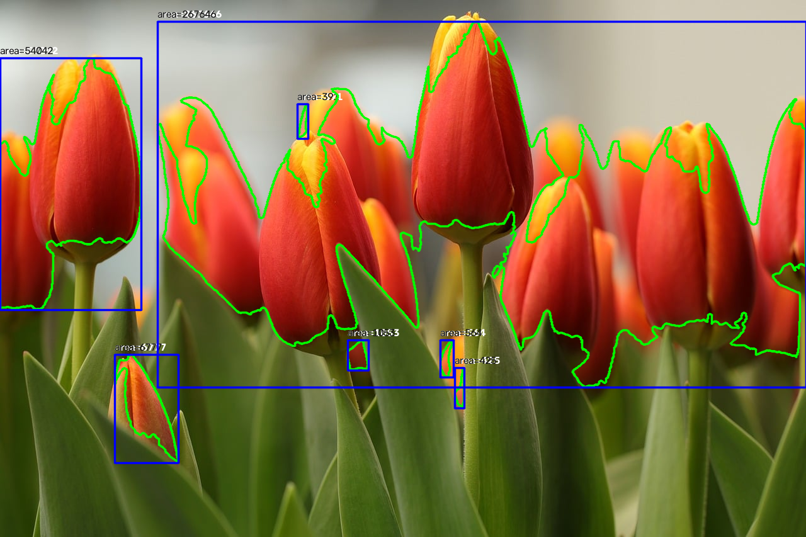

# RoboMaster 第二次培训作业

这是第二次培训的 C++ / OpenCV 作业工程。三个任务共用根目录的 `CMakeLists.txt`，源码按任务拆分，所有结果统一放在 `result/`。

## 完成内容

| 任务 | 分值 | 程序 | 输出 |
| --- | ---: | --- | --- |
| 任务 1：郁金香图片处理 | 30 | `task1_image` | 16 张处理结果与轮廓面积 |
| 任务 2：合成旋转视频拟合 | 30 | `task2_fit` | 标注视频、拟合/角速度/残差图、参数与 RMSE |
| 任务 3：能量机关跟踪 | 40 | `task3_windmill` | 两个完整标注视频、二值化视频、稳定锁定说明 |

## 环境依赖

- Ubuntu 22.04 LTS
- CMake 3.16 或更高版本
- 支持 C++17 的 GCC/G++
- OpenCV 4.x（core、imgproc、imgcodecs、videoio）

```bash
sudo apt update
sudo apt install -y git cmake g++ libopencv-dev
```

## 构建

```bash
git clone https://github.com/JackyHu0314/RM-homework2.git
cd RM-homework2
cmake -S . -B build -DCMAKE_BUILD_TYPE=Release
cmake --build build -j4
```

构建会生成三个独立可执行程序：

```text
build/task1_image
build/task2_fit
build/task3_windmill
```

## 输入素材

```text
resources/test_image.jpg  # 郁金香图片，已包含
resources/task_2.mp4      # 合成旋转视频，需使用老师发放的原文件
resources/task_3.mp4      # 小能量机关，需使用老师发放的原文件
resources/task_4.mp4      # 大能量机关，需使用老师发放的原文件
```

原始视频应保持文件名不变。程序会读取视频的实际分辨率、FPS 和帧数，不会通过删帧或改变播放速度掩盖识别问题。

## 运行

### 任务 1：OpenCV 图片处理

```bash
./build/task1_image resources/test_image.jpg result/task1_images
```

使用的主要参数：

- 均值滤波：5×5；高斯滤波：5×5，`sigma=1.5`；中值滤波：5。
- 红色 HSV：`H=[0,12] ∪ [165,179]`，`S=[70,255]`，`V=[50,255]`。
- 形态学：5×5 椭圆核；轮廓最小面积：300 px²。
- 红色连通区域包括红色花瓣和部分深红阴影；黄色花瓣通常不进入掩膜。阴影导致同一朵花可能分成多个连通区域，因此框选对象按作业要求解释为红色连通区域，不强行等同于完整花朵。
- 均值滤波对边缘模糊最明显；高斯滤波在降噪和保留花瓣轮廓之间更平衡；中值滤波能抑制孤立噪声并保留较清晰边缘。

结果索引：

| 步骤 | 文件 |
| --- | --- |
| 灰度与 HSV 通道 | `gray.png`、`hsv_h.png`、`hsv_s.png`、`hsv_v.png` |
| 三种滤波 | `mean_filter.png`、`gaussian_filter.png`、`median_filter.png` |
| 红色与形态学 | `red_mask.png`、`erode.png`、`dilate.png`、`open.png`、`close.png` |
| 轮廓、绘制与变换 | `contours_boxes.png`、`drawing.png`、`rotated_35deg.png`、`crop_top_left.png` |



### 任务 2：合成旋转视频参数拟合

```bash
./build/task2_fit resources/task_2.mp4 result/task2_fit
```

程序用 HSV 提取青色圆点，以画面中心计算角度并展开。对角度中心差分得到角速度，做 11 帧移动平均；模型采用

```text
omega(t) = b + A sin(Omega t + phi)
```

在 `Omega > 0` 的区间内搜索频率；固定频率时将正弦、余弦项转为线性最小二乘，最后恢复 `A` 和 `phi`。仅接受 `A > 0`、`b > A` 的解，相位归一化到 `[-pi, pi)`。参数、角速度 RMSE、有效样本数和帧范围写入 [任务 2 结果说明](result/task2_fit_result.md)。

### 任务 3：真实能量机关识别与稳定跟踪

同一程序通过输入路径处理两个视频：

```bash
./build/task3_windmill resources/task_3.mp4 result/task3_windmill/task_3
./build/task3_windmill resources/task_4.mp4 result/task3_windmill/task_4
```

- R 标中心逐帧检测，并对位置做平滑，不用固定坐标代替移动中心。
- 扇叶关联同时考虑相对中心角度、旋转半径和上一帧位置，不使用轮廓列表顺序作为 ID。
- 目标短时丢失时保留 ID 并显示 `lost`；连续丢失 18 帧后才允许重选。
- 输出保留完整帧序列和输入 FPS，并显示中心、扇叶圆、两中心连线、目标 ID 与状态。

详细规则和实际结果见 [任务 3 跟踪说明](result/task3_tracking_result.md)。

## 项目结构

```text
.
├── .github/workflows/build.yml
├── CMakeLists.txt
├── README.md
├── config/vision_parameters.yml
├── include/vision_utils.hpp
├── resources/
│   ├── test_image.jpg
│   └── README.md
├── src/
│   ├── task1_image/main.cpp
│   ├── task2_fit/main.cpp
│   └── task3_windmill/main.cpp
└── result/
    ├── task1_images/
    ├── task2_fit/
    ├── task2_fit_result.md
    ├── task3_tracking_result.md
    └── task3_windmill/
```

## 验证

```bash
ctest --test-dir build --output-on-failure
```

GitHub Actions 会在 Ubuntu 22.04 上安装 OpenCV、配置并构建全部三个程序，然后运行任务 1 测试。任务 2 和任务 3 的结果必须使用老师发放的视频生成，仓库不会填写虚构参数或伪造视频结果。
